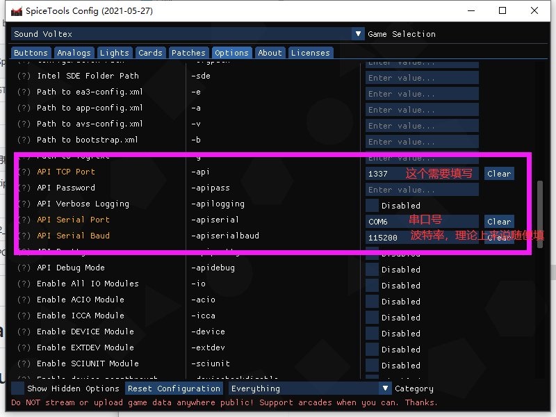

# PN532 SpiceAPI Mifare14443A/Felica CardReader

   
  

# Support Device

STM32Duino STM32F1 Boards with CDC Support  
PN532 in I2C Mode

# Support Cards

Felica Cards(Japan transport Cards,Amusement IC Cards,or some Sony earphone NFC)  
Read IDM for Card ID  
Mifare ISO14443A Cards(Old Aime Banapass Cards,or any Mifare14443A Cards)
Read UID for Card ID

doesn't support Old E-Pass Card

# Usage Guide

1. Update your SpiceTools to the newest Release https://github.com/spicetools/spicetools    
2.    

(Any BaudRate should work because STM32 uses USB-CDC for a Serial Port.  
And for the COMID , the COM6 is Better  (can be changed in devmgmt.msc))  

3. Start the Game

# Todo 
1. RC4 Crypt
2. Keypad Support

# Thanks  
https://github.com/spicetools/spicetools    
https://github.com/CrazyRedMachine/PN5180-cardio

# Also Read | PCB Design

https://github.com/HelloworldDk/stm32_aimereader

